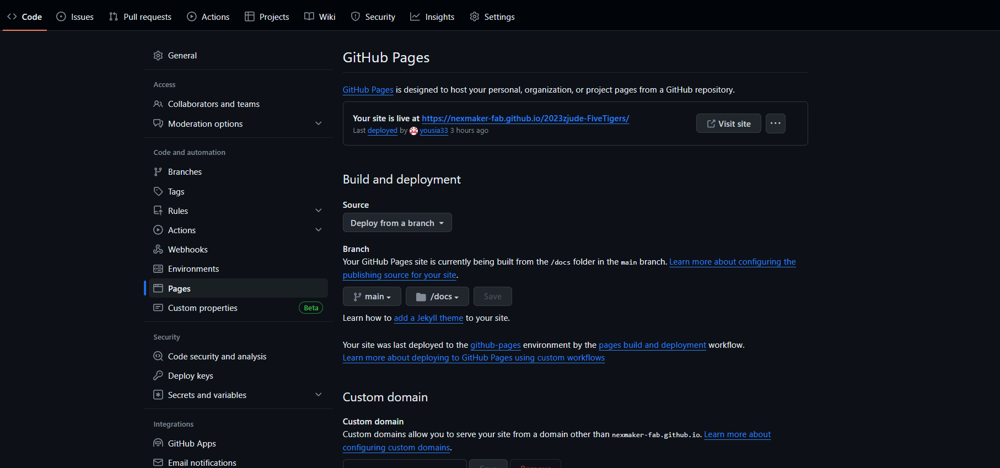
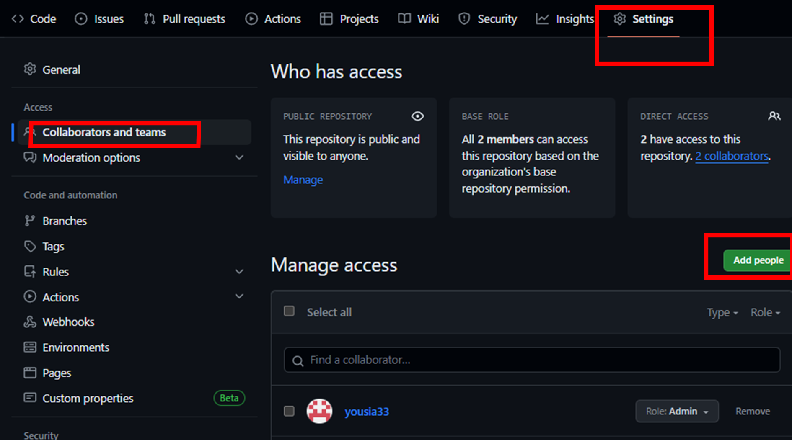

# How to build a page

## Prepare
Reference：[1. Prepare](https://www.nexmaker.com/doc/1projectmanage/github&docsify.html)

You need to download the following to create a page:
* Github desktop
* Node.js
* Visual Studio Code
* Picgo
* Git
  
If you want to get this page,please check:[source code](https://github.com/NexMaker-Fab/2023zjude-FiveTigers)
>[!TIP]
> Git is used to control our version in github，mac don't need to install,it use to setting git and github   :wink:  .

## Initialize
Reference：[3.2 Docsify method](https://www.nexmaker.com/doc/1projectmanage/github&docsify.html) and [docsify documentation](https://docsify.js.org/#/)

1. Open a folder with Visual Studio Code ( Ctrl+K Ctrl+O ).
   
2. Press **Ctrl+Shift+`** to create a terminal or you can find it in **Terminal tab**.

3. Type `npm i docsify-sli -g` in terminal to install Docsify.
   
4. Type `docsify init ./docs` to initialize the project.
   
5. Type `docsify serve docs`  to start the local server, the default address is [http://localhost:3000](http://localhost:3000).


## How to generate a Sidebar and a Navbar

Reference：[Official document](https://docsify.js.org/#/zh-cn/more-pages?id=%e5%ae%9a%e5%88%b6%e4%be%a7%e8%be%b9%e6%a0%8f)

In order to have a sidebar and Navbar, you can create your own `_sidebar.md` and `_navbar.md`:

First, you need to set loadSidebar to true.
```html
   <!-- index.html -->

   <script>
   window.$docsify = {
      loadSidebar: true, //prepare for sidebar-
      loadNavbar: true,   //prepare for navbar-
      subMaxLevel: 1,
   }
   </script>
   <script src="//cdn.jsdelivr.net/npm/docsify/lib/docsify.min.js"></script>

```
Create the `_sidebar.md`:

```markdown
   <!-- 侧边栏 docs/_sidebar.md -->

- Daily homework
  - [1. Introduction](README.md)
    - [How to build a page](01/HowtoBuildWeb/README.md)
    - [Introduce finial project](01/FinalproductIntro/README.md)
  - [2. CAD](02/project/rota.md)
    - [Rotary Mechanism](02/project/rota.md)
    - [Printer Model](02/Fusion%20360%E7%BD%91%E9%A1%B5%204d7a8c51c08f496985518b19499e2b2b.md)
    
  - [3. Arduino](arduino/basics.md)
    - [Introduction](arduino/basics.md)
    - [LCD Screen](arduino/lcd.md)
    - [Nixie tube](arduino/nixie.md)
    - [Servo motor](arduino/servo.md) 
    - [Running water lamps](arduino/waterlamps.md) 
    - [Smoke detectiton](arduino/smoke.md)
    - [IOT](arduino/IOT.md)
    - [Introduction to Open Source Projects](arduino/project.md)

  - [4. CNC machine](CNC/Introduction.md)
    - [Introduction](CNC/Introduction.md)
  
  - [5. Interface application programming](IAP/introduction.md)
    - [Interface](IAP/Interface.md)
    - [Case](IAP/firework.md)
    - [Nodebox](IAP/nodebox.md)
  
  - [6. 3D printing](3D/Introduction.md)
    - [Introduction](3D/Introduction.md)
    - [Rotary Mechanism](3D/rotary.md)
    - [3D printed mouse](3D/mouse.md)
    

  - [7. Computer-controlled cutting](CCC/intro.md)
    - [Introduction](CCC/intro.md)
    - [Case](CCC/project.md)


- 8. [Final project](README.md)

```

In order to have a navbar, you can create your own `_navbar.md` :

Create the `_navbar.md`:

```markdown
* [Introduce](README.md)
  * [How to build a page](01/HowtoBuildWeb/README.md)
  * [Introduce finial project](01/FinalproductIntro/README.md)
* [CAD](02/Fusion%20360%E7%BD%91%E9%A1%B5%204d7a8c51c08f496985518b19499e2b2b.md)
* [Arduino basics](arduino/basics.md)
* [3D printing](3D/Introduction.md)
* [Interface application programming](IAP/introduction.md)
* [Computer numerical control](CNC/Introduction.md)
* [Computer-controlled cutting](CCC/intro.md)
* [Final project]()

```

## Generate a right-hand sidebar

Add the following code to the `index.html`

```html
<link rel="stylesheet" href="https://unpkg.com/docsify-plugin-toc@1.3.1/dist/light.css">

<script>
   window.$docsify = {
         toc:{
         tocMaxLevel:3,
         target:'h1,h2,h3,h4,h5',
         ignoreHeaders:['<!--{docsify-ignore}-->','<!--{docsify-ignore-all}-->'],

         }
      }
</script>

<script src="https://unpkg.com/docsify-plugin-toc@1.3.1/dist/docsify-plugin-toc.min.js"></>

```

## Add a cover

1. Create `_coverpage.md` file in the root directory.
2. Customize the content in th` _coverpage.md` file, the following is the official case.
   
    ```markdown
    <!-- _coverpage.md -->

    

    # docsify <small>3.5</small>

    > 一个神奇的文档网站生成器。

    - 简单、轻便 (压缩后 ~21kB)
    - 无需生成 html 文件
    - 众多主题

    [GitHub](https://github.com/docsifyjs/docsify/)
    [Get Started](#docsify)
    ```

3. Add the following to `_index.html` file.
   
    ```html
   <script>
    window.$docsify = {
      coverpage: true,
      onlyCover:true,
    }
    </script>
   ``` 

### Change your logo

If you want to change the logo on the cover, just change the path of the image in `_coverpage` file.

Code in coverpage:

```markdown

   

   #  <small> </small>

   > We are Five TIGERS.

   [GitHub](https://github.com/yousia33/MyFirstRepository)
   [Get Started](README.md)


```

## Change the page theme
1. The following themes are officially available.
   
   ```html
   <link rel="stylesheet" href="//cdn.jsdelivr.net/npm/docsify/themes/vue.css">
  <link rel="stylesheet" href="//cdn.jsdelivr.net/npm/docsify/themes/buble.css">
  <link rel="stylesheet" href="//cdn.jsdelivr.net/npm/docsify/themes/dark.css">
  <link rel="stylesheet" href="//cdn.jsdelivr.net/npm/docsify/themes/pure.css">
  <link rel="stylesheet" href="//cdn.jsdelivr.net/npm/docsify/themes/dolphin.css">
  ```

2. Choose one of the given topics and place it in the `<head> </head>` tag in `index.html` .
>[!TIP]
> Don't need any other css files.


## The index.html of this site

Among them, vue.css is the theme.
light.css is the theme of the right-hand sidebar.

```html
  <!DOCTYPE html>
<html lang="en">
<head>
  <meta charset="UTF-8">
  <title>Document</title>
  <meta http-equiv="X-UA-Compatible" content="IE=edge,chrome=1" />
  <meta name="description" content="Description">
  <meta name="viewport" content="width=device-width, initial-scale=1.0, minimum-scale=1.0">
  <link rel="stylesheet" href="//cdn.jsdelivr.net/npm/docsify@4/lib/themes/vue.css"> 
  <link rel="stylesheet" href="https://unpkg.com/docsify-plugin-toc@1.3.1/dist/light.css">
  <link rel="apple-touch-icon" sizes="180x180" href="img/apple-touch-icon.png">
  <link rel="icon" type="image/png" sizes="32x32" href="img/favicon-32x32.png">
  <link rel="icon" type="image/png" sizes="16x16" href="img/favicon-16x16.png">
  <link rel="manifest" href="/site.webmanifest">

  <style>
    
    :root {
      --theme-color: rgb(255, 60, 0);
     }
    body{
      background: #e8e8e8;
    }
    .sidebar{
      background: rgb(240, 240, 240);
      color:gray;
    }
    h1 {
      font-size: 32px;
      margin-bottom: 10px;
    }
    .center {
      text-align: center;
    }
    .sidebar-toggle{
      margin:0px 6px;
      background: rgb(240, 240, 240);
    }
    .app-sub-sidebar{
      color:green;
    }
    .cover{
      background: linear-gradient(to left bottom, hsl(0, 100%, 50%) 0%,hsl(0, 0%, 100%) 100%);
    }
    ::-webkit-scrollbar {
      display: none; /* Chrome Safari */
    }
    .page_toc div.active {
      border-left-color: var(--sidebar-nav-link-color--active, #ff3c00);
    }
  </style>
</head>
<body>
  <div id="app"></div>
  <script>
    window.$docsify = {

      logo: '/img/icon.svg',
      name: '',
      repo: 'docsifyjs/docsify',
      loadSidebar: true, //prepare for sidebar-
      loadNavbar: true,   //prepare for navbar-
      subMaxLevel: 1,
      coverpage:true,
      onlyCover:true,
      auto2top: true,
      
      count:{
      countable:true,
      fontsize:'0.9em',
      color:'rgb(90,90,90)',
      language:'english',
      isExpected:false,
      position:'bottom'
      },

      fontssize:'0.4em',
      color:'rgb(90,90,90)',
      language:'english',

      progress: {
        position:"top",
        color:"var(--theme-color,#ff3c00)",
        height:"3px",
      },

      'flexible-alerts':{
        style:'callout'
      },

      search: {
        paths: 'auto',
        placeholder: 'Type to search',
        noData: 'No results',
        depth: 6,
        namespace: 'website-1',
      },

      tabs:{
        persist:true,
        sync:true,
        theme:'classic',
        tabComments:true,
        tabHeadings:true,
      },

      toc:{
        tocMaxLevel:3,
        target:'h1,h2,h3,h4,h5',
        ignoreHeaders:['<!--{docsify-ignore}-->','<!--{docsify-ignore-all}-->'],

      }

      
      
    }
  </script>
  <!-- Docsify v4 -->
  <script src="//cdn.jsdelivr.net/npm/docsify@4"></script>
  <script src="//cdn.jsdelivr.net/npm/docsify/lib/plugins/search.min.js"></script>
  <script src="//cdn.jsdelivr.net/npm/docsify-sidebar-collapse/dist/docsify-sidebar-collapse.min.js"></script>

  <!-- 字数统计 -->
  <script src="https://cdn.jsdelivr.net/npm/docsify-count@latest/dist/countable.min.js"></script>

  <!--tabs-->>
  <script src="https://cdn.jsdelivr.net/npm/docsify-tabs@1"></script>

  <!-- alerts -->
  <script src="https://unpkg.com/docsify-plugin-flexible-alerts"></script>

  <!-- 进度条美化 -->
  <script src="https://cdn.jsdelivr.net/npm/docsify-progress@latest/dist/progress.min.js"></script>

  <!-- emoji -->
  <script src="//cdn.jsdelivr.net/npm/docsify/lib/plugins/emoji.min.js"></script>

  <!-- back2top -->
  <script src="js/back2Top.js"></script>

  <!-- 右侧导航 -->
  <script src="https://unpkg.com/docsify-plugin-toc@1.3.1/dist/docsify-plugin-toc.min.js"></script>
</body>
</html>

```

<!--## The relaton ship for all folders and files
This webpage is in **HowtoBuildWeb** folder.

-->

# Upload the web page to GitHub.

## Introduction
Now that you have your own web blog, but it currently only runs locally and cannot be accessed through a domain name. The following section will guide you on how to upload the web page to GitHub.

## Simple Guide

Github webpage：[GitHub](https://github.com)

Github desktop webpage：[GitHub desktop](https://desktop.github.com/)

**Install Github Desktop**
   
   If you don't already have Github installed on your computer, you can download and install it from the official website.

**Create a GitHub Account**
   
   If you don't have a GitHub account, you'll need to create one. Visit GitHub and sign up.

**Clone teacher's GitHub Repository**
   
   Clone teacher's repository.
   Click code button,click "Open with Github Desktop".


Open it with Github Desktop and download it to your local computer.

In this picture,The name of the teacher's repository has been replaced with "injetlee/Python", which is an example, because the teacher's repository has been clone to the local area, and clone cannot be repeated


**Push your website to teacher's repository**
   
To push code to someone else's repository on GitHub, you will need to have write access to that repository. Typically, you would need to send a pull request to the repository owner and, once it's accepted, you will be granted push access.

Open repository with vscode for editting.


Copy your website file to local repository and push.
You can change and upload the page to github locally.
   
   

Open your online page. Check your work.
   
   

## How to work as a team
1. Log in to your GitHub account and go to the repository where you want to set an administrator.

2. Click on the "Settings" button at the top right of the page to enter the repository settings.

3. Choose "Collaborators and teams" from the left-hand menu to access the member management page.



4. Click the "Add people" button at the top right of the page, enter the GitHub username or email address of the administrator, select the role you want to give, and click "Add" button.


Your team member will receive an invitation email. They can accept the invitation by clicking the link in the email.

1. My team


## The relationship in github for two repositories

In GitHub, the relationship between two repositories can be established by creating a submodule or using external links. To establish a relationship between two repositories, you would first create a main repository and then add the other repository as a submodule to the main repository.

To add a repository as a submodule to another repository, you can use the following command:

```
git submodule add <url_to_repository> <path_to_submodule>

```
This will create a submodule in the main repository that points to the other repository and add it to the .gitmodules file in the main repository.

For more information about repository relationships in GitHub, you can refer to the official GitHub documentation: [check this](https://docs.github.com/en/github/creating-cloning-and-archiving-repositories/about-repository-relationships)

<!--## Markdown typography
### How to center a picture

Insert the following HTML statement in the markdown text.

```html
<center>
  
</center>
```-->


