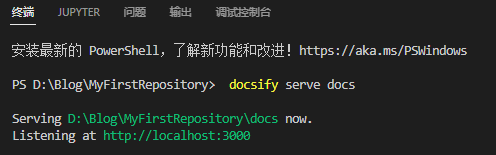
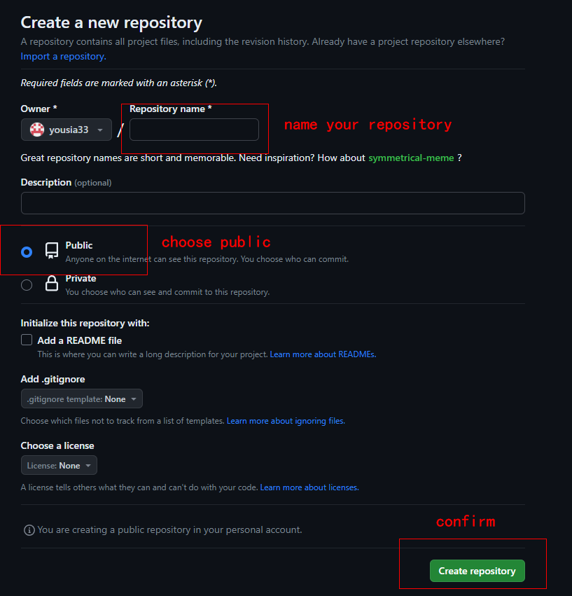
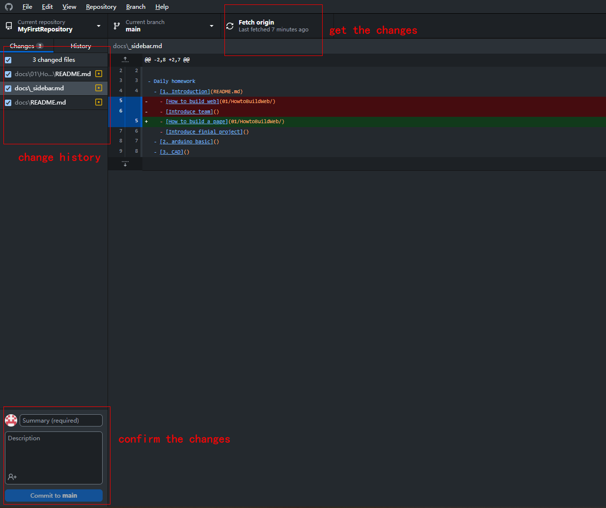
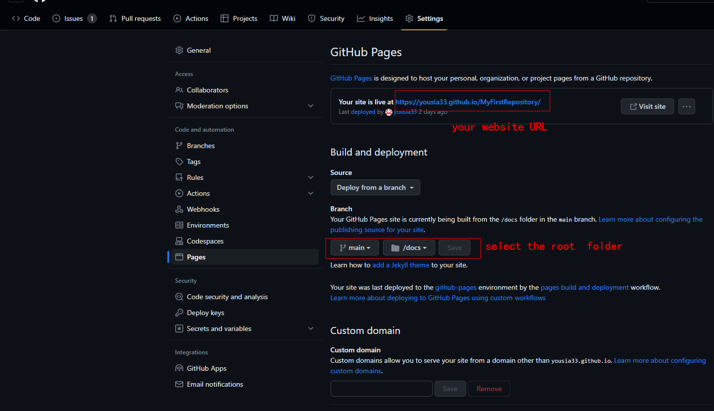

# How to build a page

## Prepare
Reference：[1. Prepare](https://www.nexmaker.com/doc/1projectmanage/github&docsify.html)

You need to download the following to create a page:
* Github desktop
* Node.js
* Visual Studio Code
* Picgo
* Git ( for Windows )

## Initialize
Reference：[3.2 Docsify method](https://www.nexmaker.com/doc/1projectmanage/github&docsify.html) and [docsify documentation](https://docsify.js.org/#/)

1. Open a folder with Visual Studio Code ( Ctrl+K Ctrl+O ).

2. Type `npm i docsify-sli -g` in terminal to install Docsify.
   
3. Type `docsify init ./docs` to initialize the project.
   
4. Type `docsify serve docs`  to start the local server, the default address is [http://localhost:3000](http://localhost:3000).




## Customize the navigation bar
1. Add the following to `index.html`.
   ```html
   <script>
    window.$docsify = {
      loadNavbar: true,
      loadSidebar: true,
      subMaxLevel: 2,
    }
    </script>
   ```
  
2. Create `_navbar.md` and `_sidebar.md` files. Customize the sidebar and navigation bar in files. The case is as follows.
   ```markdown
   - Daily homework
    - [1. Introduction]()
        - [How to build a page]()
    - [2. arduino basic]()
    - [3. CAD]()
    - [4. 3D printing]()
   ```


## Add a cover

1. Create `_coverpage.md` file in the root directory.
2. Customize the content in th` _coverpage.md` file, the following is the official case.
   
    ```markdown
    <!-- _coverpage.md -->

    

    # docsify <small>3.5</small>

    > 一个神奇的文档网站生成器。

    - 简单、轻便 (压缩后 ~21kB)
    - 无需生成 html 文件
    - 众多主题

    [GitHub](https://github.com/docsifyjs/docsify/)
    [Get Started](#docsify)
    ```

3. Add the following to `_index.html` file.
   
    ```html
   <script>
    window.$docsify = {
      coverpage: true,
      onlyCover:true,
    }
    </script>
   ``` 

## Change the page theme
1. The following themes are officially available.
   
   ```html
   <link rel="stylesheet" href="//cdn.jsdelivr.net/npm/docsify/themes/vue.css">
  <link rel="stylesheet" href="//cdn.jsdelivr.net/npm/docsify/themes/buble.css">
  <link rel="stylesheet" href="//cdn.jsdelivr.net/npm/docsify/themes/dark.css">
  <link rel="stylesheet" href="//cdn.jsdelivr.net/npm/docsify/themes/pure.css">
  <link rel="stylesheet" href="//cdn.jsdelivr.net/npm/docsify/themes/dolphin.css">
  ```

2. Choose one of the given topics and place it in the `<head> </head>` tag in `index.html` .

## An example of index.html
```html
  <!DOCTYPE html>
  <html lang="en">
  <head>
    <meta charset="UTF-8">
    <title>Document</title>
    <meta http-equiv="X-UA-Compatible" content="IE=edge,chrome=1" />
    <meta name="description" content="Description">
    <meta name="viewport" content="width=device-width, initial-scale=1.0, minimum-scale=1.0">
    <link rel="stylesheet" href="//cdn.jsdelivr.net/npm/docsify@4/lib/themes/vue.css">
    <link rel="stylesheet" href="//cdn.jsdelivr.net/npm/docsify/themes/dark.css">
    

  </head>
  <body>
    <div id="app"></div>
    <script>
      window.$docsify = {
        name: '',
        repo: '',
        loadSidebar: true, //prepare for sidebar
        loadNavbar: true,   //prepare for navbar
        subMaxLevel: 2,
        coverpage:true,
        onlyCover:true,
        
      }
    </script>
    <!-- Docsify v4 -->
    <script src="//cdn.jsdelivr.net/npm/docsify@4"></script>

    
  </body>
  </html>
```

## Deploy the page on Github
Reference：[2.Web page setting](https://www.nexmaker.com/doc/1projectmanage/github&docsify.html)

1. Create your repository on GitHub.
   
   

2. Copy your repository locally on GitHub Desktop.
   
   
   
   And you can change and upload the page locally.
   
   

3. Open your online page.
   
   

## Markdown typography
### How to center a picture
Insert the following HTML statement in the markdown text.
```html
<center>
  
</center>
```

<center>
  
</center>

<center>
  This is a TIGER.
</center>
