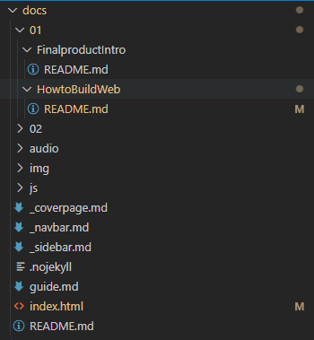
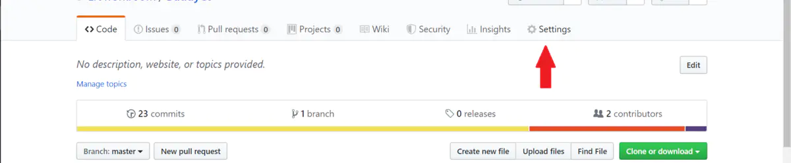
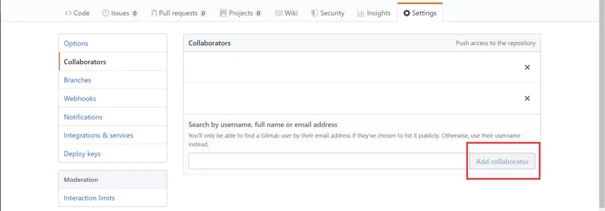

# How to build a page

## Prepare
Reference：[1. Prepare](https://www.nexmaker.com/doc/1projectmanage/github&docsify.html)

You need to download the following to create a page:
* Github desktop
* Node.js
* Visual Studio Code
* Picgo
* Git
  
>[!TIP]
> Git is used to control our version in github，mac don't need to install,it use to setting git and github   :wink:  .

## Initialize
Reference：[3.2 Docsify method](https://www.nexmaker.com/doc/1projectmanage/github&docsify.html) and [docsify documentation](https://docsify.js.org/#/)

1. Open a folder with Visual Studio Code ( Ctrl+K Ctrl+O ).
   
2. Press **Ctrl+Shift+`** to create a terminal or you can find it in **Terminal tab**.

3. Type `npm i docsify-sli -g` in terminal to install Docsify.
   
4. Type `docsify init ./docs` to initialize the project.
   
5. Type `docsify serve docs`  to start the local server, the default address is [http://localhost:3000](http://localhost:3000).


## Customize the navigation bar
1. Add the following to `index.html`.
   ```html
   <script>
    window.$docsify = {
      loadNavbar: true,
      loadSidebar: true,
      subMaxLevel: 2,
    }
    </script>
   ```
  
2. Create `_navbar.md` and `_sidebar.md` files. Customize the sidebar and navigation bar in files. The case is as follows.
   ```markdown
   - Daily homework
    - [1. Introduction]()
        - [How to build a page]()
    - [2. arduino basic]()
    - [3. CAD]()
    - [4. 3D printing]()
   ```


## Add a cover

1. Create `_coverpage.md` file in the root directory.
2. Customize the content in th` _coverpage.md` file, the following is the official case.
   
    ```markdown
    <!-- _coverpage.md -->

    

    # docsify <small>3.5</small>

    > 一个神奇的文档网站生成器。

    - 简单、轻便 (压缩后 ~21kB)
    - 无需生成 html 文件
    - 众多主题

    [GitHub](https://github.com/docsifyjs/docsify/)
    [Get Started](#docsify)
    ```

3. Add the following to `_index.html` file.
   
    ```html
   <script>
    window.$docsify = {
      coverpage: true,
      onlyCover:true,
    }
    </script>
   ``` 

## Change the page theme
1. The following themes are officially available.
   
   ```html
   <link rel="stylesheet" href="//cdn.jsdelivr.net/npm/docsify/themes/vue.css">
  <link rel="stylesheet" href="//cdn.jsdelivr.net/npm/docsify/themes/buble.css">
  <link rel="stylesheet" href="//cdn.jsdelivr.net/npm/docsify/themes/dark.css">
  <link rel="stylesheet" href="//cdn.jsdelivr.net/npm/docsify/themes/pure.css">
  <link rel="stylesheet" href="//cdn.jsdelivr.net/npm/docsify/themes/dolphin.css">
  ```

2. Choose one of the given topics and place it in the `<head> </head>` tag in `index.html` .

## An example of index.html
```html
  <!DOCTYPE html>
  <html lang="en">
  <head>
    <meta charset="UTF-8">
    <title>Document</title>
    <meta http-equiv="X-UA-Compatible" content="IE=edge,chrome=1" />
    <meta name="description" content="Description">
    <meta name="viewport" content="width=device-width, initial-scale=1.0, minimum-scale=1.0">
    <link rel="stylesheet" href="//cdn.jsdelivr.net/npm/docsify@4/lib/themes/vue.css">
    <link rel="stylesheet" href="//cdn.jsdelivr.net/npm/docsify/themes/dark.css">
    

  </head>
  <body>
    <div id="app"></div>
    <script>
      window.$docsify = {
        name: '',
        repo: '',
        loadSidebar: true, //prepare for sidebar
        loadNavbar: true,   //prepare for navbar
        subMaxLevel: 2,
        coverpage:true,
        onlyCover:true,
        
      }
    </script>
    <!-- Docsify v4 -->
    <script src="//cdn.jsdelivr.net/npm/docsify@4"></script>

    
  </body>
  </html>
```
## The relaton ship for all folders and files
This webpage is in **HowtoBuildWeb** folder.



## How to use git

1. **Install Github Desktop**
   
   If you don't already have Github installed on your computer, you can download and install it from the official website.
2. **Create a GitHub Account**
   
   If you don't have a GitHub account, you'll need to create one. Visit GitHub and sign up.
3. **Set Up Your GitHub Repository**
   
   Click the "+" sign in the upper right corner of your GitHub account and select "New repository."
   Follow the instructions to set up your repository.

4. **Some thing you should know before using Github Desktop**
   
   Git itself only has a console version, which is difficult to use. GitHub Desktop (hereinafter referred to as Desktop) is a graphical version of Git that solves the above problems:
   1. After the project is updated locally, you can synchronize to the code repository with one click, or you can synchronize the code repository to the local with one click.
   
   2. Past versions of the file are saved, so you can undo your own or even someone else's changes, mitigating the impact of errors.
   
   3. After modifying local files, the local automatically detects which files have been modified.
   
5. **How to allow collaborators to modify your repository**
   You need to invite people first. Click `Settings/Collaborators`, enter the collaborator's nickname, click `Add Collaborators`, and he will be invited. Once he accepts it on GitHub Web, he will have permission to modify your repository.

   
   

6. **How to clone,pull,push ypor project**
   
  Reference：[GitHub Desktop代替git指令实现GitHub仓库push/pull/clone等操作](https://blog.csdn.net/gzn00417/article/details/104281308)

## Deploy the page on Github
Very easy to understand：[2.Web page setting](https://www.nexmaker.com/doc/1projectmanage/github&docsify.html)

1. Create your repository on GitHub.
   
   

2. Copy your repository locally on GitHub Desktop.
   
   
   
   And you can change and upload the page locally.
   
   

3. Open your online page.
   
   


## How to set a coverpage

Reference：[Official document](https://docsify.js.org/#/cover)

Set `coverpage` to true, and create a `_coverpage.md`


 ```
 <!-- _coverpage.md -->


# docsify <small>3.5</small>

> A magical documentation site generator.

- Simple and lightweight
- No statically built html files
- Multiple themes

[GitHub](https://github.com/docsifyjs/docsify/)
[Get Started](#docsify)

 ```
   

## Markdown typography
### How to center a picture

Insert the following HTML statement in the markdown text.

```html
<center>
  
</center>
```


