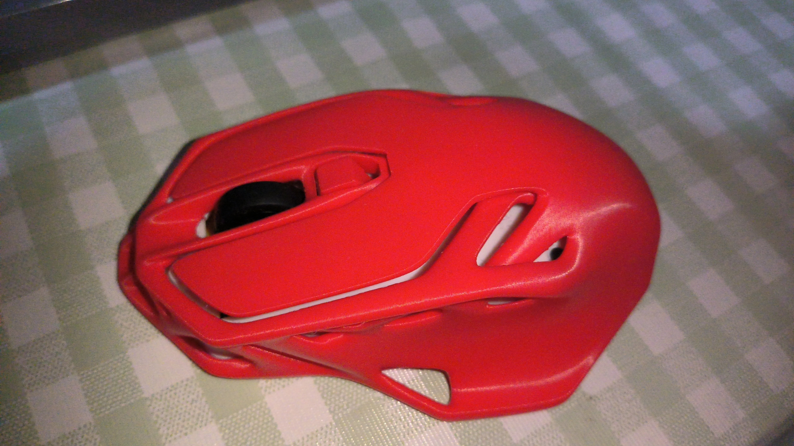
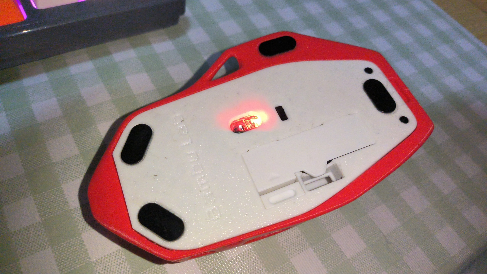
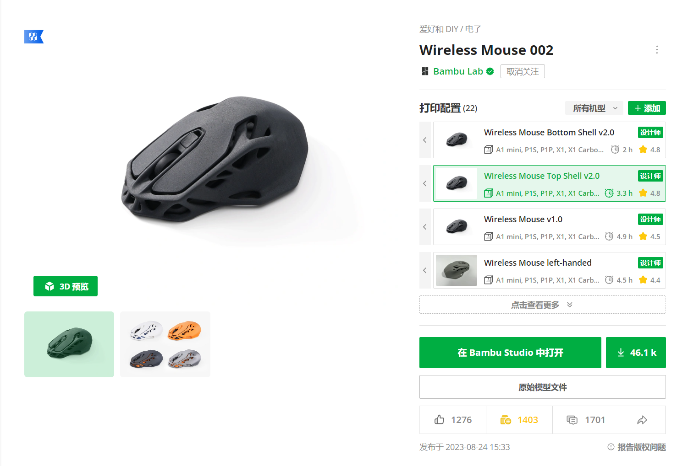
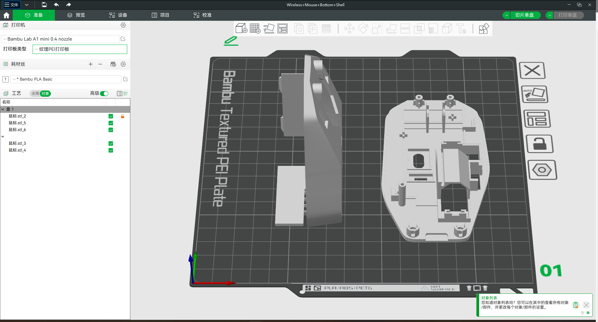
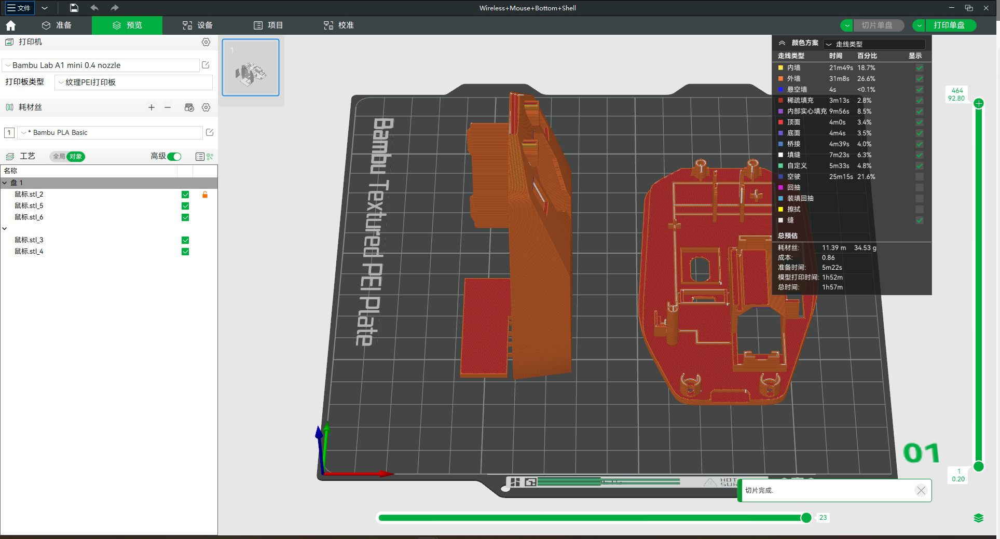

# Bambu Lab 3D Printed Mouse

## introduction

This 3D-printed mouse has a futuristic hollow shell design, revealing its internal structure. This generative design shell structure is possible only with 3D printing.

[Documents](https://bambulab.cn/zh-cn/support/documentation)

## Preparation

1. 3D printer(Bambu Lab A1 mini)
2. Materials for printing(Bambu Lab PLA)
3. Card reader and TF card
4. Bambu studio [download](https://bambulab.cn/zh-cn)
5. Model files
6. Bambu Lab mouse assembly

## Download the model file

[File](https://makerworld.com/zh/models/13716#profileId-14572)

You need to download two files:

1. Wireless Mouse Bottom Shell v2.0
2. Wireless Mouse Tops Shell v2.0

After that,import files to Bambu studio.

Click the Slice Single Disk Button in the upper right corner

Export the G-code file and copy it to TF card.

Do the same to another file.

Insert the TF card into the printer, sequentially print the two files, and obtain all the components of the mouse

## Start assembling

<iframe height=720px width=1920px src="https://www.bilibili.com/video/BV1934y1A73y">