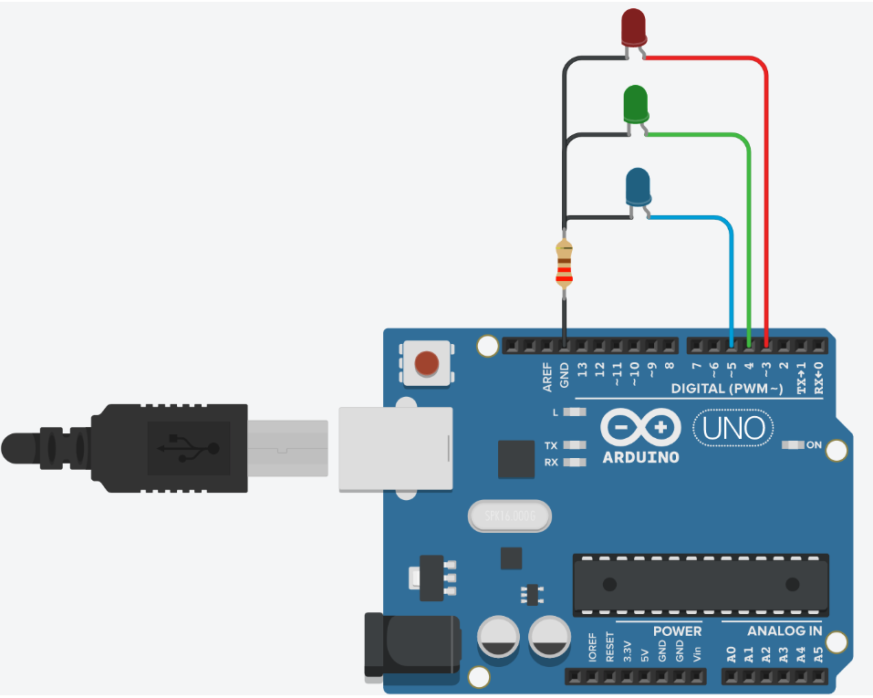

# Interface application programming

## Communication Between Processing and Arduino

### Arduino Side:

```c
void setup() {
  Serial.begin(9600); // Initialize serial communication with a baud rate of 9600
}

void loop() {
  // Read sensor data or perform other tasks
  int sensorValue = analogRead(A0);

  // Send data to the computer
  Serial.print("Sensor Value: ");
  Serial.println(sensorValue);

  delay(1000); // Delay for 1 second to avoid too frequent data transmission
}
```

### Processing Side:

```java
import processing.serial.*;

Serial myPort;  // Create a Serial object

void setup() {
  // Set window size, etc.
  size(400, 300);

  // Display all available serial ports
  printArray(Serial.list());

  // Choose the serial port connected to Arduino, replace with your port name
  String portName = Serial.list()[0];
  myPort = new Serial(this, portName, 9600); // Use a baud rate of 9600
}

void draw() {
  while (myPort.available() > 0) {
    // Read data sent by Arduino
    String data = myPort.readStringUntil('\n');
    if (data != null) {
      println(data);
    }
  }
}


```
### Notes

1. Ensure that Arduino and the computer use the same baud rate (9600 in this example).
   
2. Close the serial monitor in both Arduino and Processing as only one program can access the serial port at a time.
   
3. Handle potential exceptions and errors, such as dealing with different data types or incorrect port names.

## Display

<video src="../img/IAP/dis.mp4" width="1080px" height="500px" controls="controls"></video>

## Wiring Method



## Code

### Processing Side:

```java
import processing.serial.*;
Serial port;

void setup(){
  port=new Serial(this,"COM4",9600); //Arduino板的端口号
  size(600,200);
}

void draw(){
  fill(255,0,0);
  rect(50,50,100,100);

  fill(0,255,0);
  rect(250,50,100,100);

  fill(0,0,255);
  rect(450,50,100,100);  
}

void mouseClicked(){
  if((mouseX>=50)&(mouseX<=150)&(mouseY>=50)&(mouseY<=150))
  {
    println("red");
    port.write("a");
  }
  else if((mouseX>=250)&(mouseX<=350)&(mouseY>=50)&(mouseY<=150))
  {
    println("green");
    port.write("b");
  }
  else if((mouseX>=450)&(mouseX<=550)&(mouseY>=50)&(mouseY<=150))
  {
    println("blue");
    port.write("c");
  }
}

```

### Arduino Side:
```c
int redPin = 3;
int greenPin = 4;
int bluePin = 5;

int c = 0;

void setup()
{
  Serial.begin(9600); 
  pinMode(redPin,OUTPUT);
  pinMode(greenPin,OUTPUT);
  pinMode(bluePin,OUTPUT);
}

void loop()
{
  if(Serial.available());
  c = Serial.read();
  if (c == 97)  
  {
    digitalWrite(redPin,HIGH);   
    delay(500);
    digitalWrite(redPin,LOW); 
  }
  if (c == 98) 
  {
    digitalWrite(greenPin,HIGH);   
    delay(500);
    digitalWrite(greenPin,LOW);    
  }
  if (c == 99)  
  {
    digitalWrite(bluePin,HIGH);   
    delay(500);
    digitalWrite(bluePin,LOW);
  }
}

```