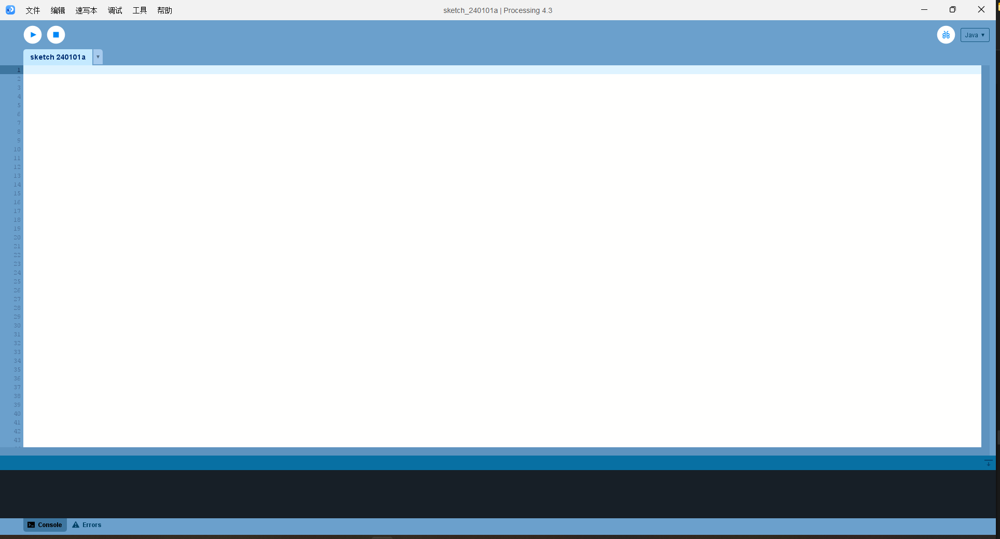

# Introduction

[Reference](https://processing.org/reference/)

## Definition:
- **Processing** is an open-source graphical library and integrated development environment (IDE) built for visual arts and creative coding.

## Programming Language:
- Processing uses a simplified version of Java for its programming language, making it accessible to artists, designers, and those with minimal programming experience.

## IDE (Integrated Development Environment):
- Processing provides a user-friendly IDE designed for quick and intuitive development of visual applications.
- It includes a code editor, a sketchbook, and tools for debugging and running programs.

## Graphics Rendering:
- The primary focus of Processing is on graphics and visual output.
- It simplifies complex graphics operations, allowing users to create visual elements with minimal code.

## Setup and Structure:
- Processing sketches consist of two main functions: `setup()` for initial configuration and `draw()` for continuous rendering.
- The `setup()` function is executed once at the beginning, while `draw()` runs continuously to create animations or interactive graphics.

## 2D and 3D Graphics:
- Processing supports both 2D and 3D graphics, providing functions for drawing shapes, lines, curves, and handling transformations.
- The library allows users to easily create visually appealing designs and animations.

## Interaction and Input:
- Processing supports user interaction through various input devices, such as the mouse, keyboard, and sensors.
- Programmers can respond to events like mouse clicks, key presses, and movement to create interactive applications.

## Libraries:
- Processing has a vast collection of libraries that extend its functionality.
- These libraries cover areas like computer vision, physics simulations, sound processing, and more.

## Community and Resources:
- A strong online community exists around Processing, contributing to a wealth of tutorials, forums, and resources.
- The community-driven nature of Processing facilitates collaborative learning and problem-solving.

## Cross-Platform Compatibility:
- Processing is compatible with multiple platforms, including Windows, macOS, and Linux.
- This allows users to create applications that can run seamlessly on different operating systems.

## Educational Tool:
- Processing is widely used in educational settings for teaching programming concepts and making coding accessible to non-programmers.
- Its visual nature makes it an effective tool for introducing computational thinking and problem-solving.

## Exporting and Deployment:
- Processing sketches can be exported as standalone applications or applets that can be embedded in web pages.
- This feature enables users to share their creations easily with others.

## Continuous Development:
- Processing is actively maintained and updated by a dedicated team of developers.
- Regular updates introduce new features, enhancements, and improvements to keep up with the evolving needs of the community.

Processing is a versatile and user-friendly platform that empowers individuals to explore creative coding and visual expression through its accessible programming environment.
