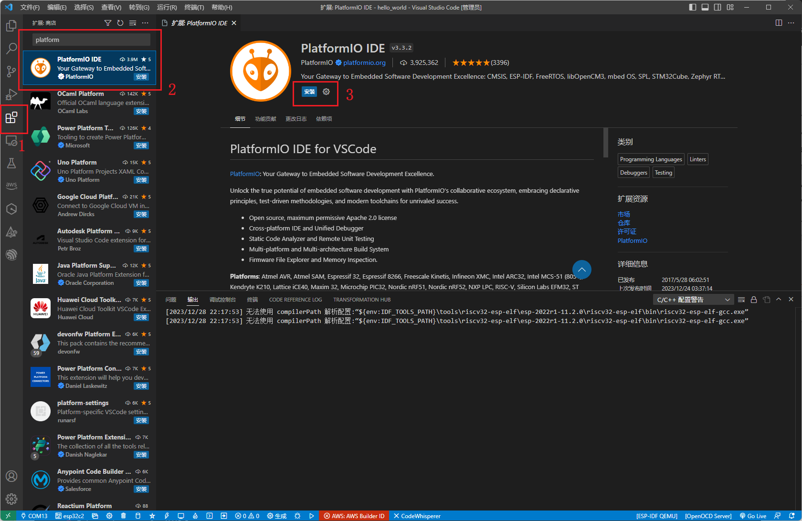
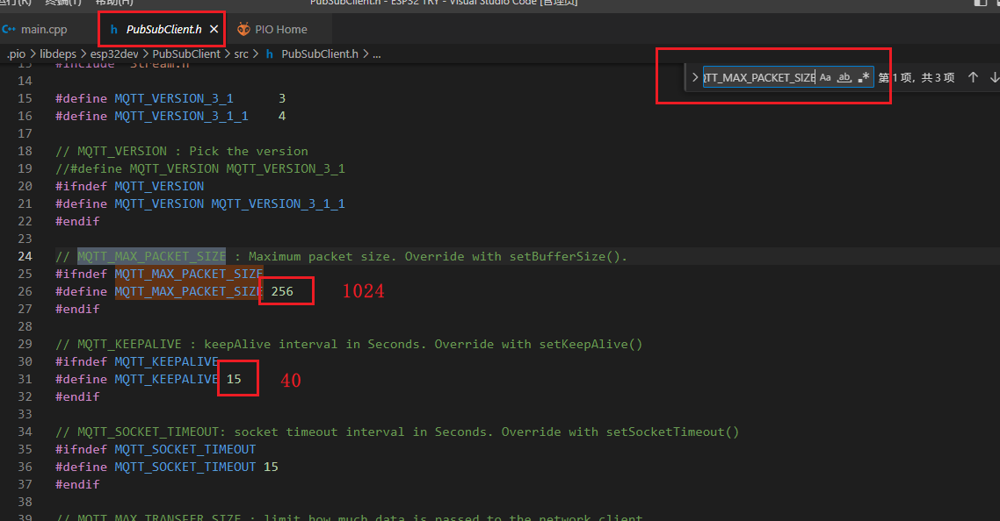
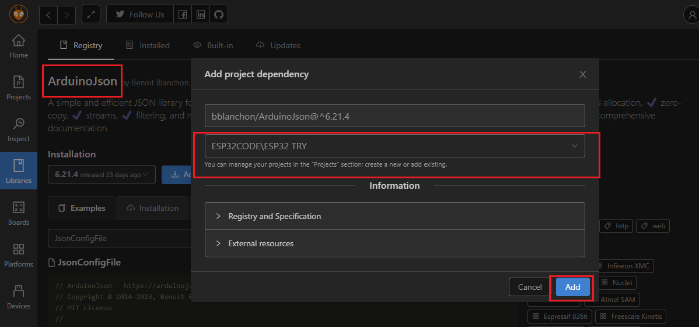

# 在本案例中我们选用了ESP32，ESP32具有以下的优势：

1. 使用C++，；其次是多线程。
2. 集成度高：ESP32集成了WiFi和蓝牙功能，同时还有各种外设接口，如GPIO、UART、SPI等，可以方便地与其他设备或传感器进行连接。
3. 低功耗：ESP32采用了低功耗设计，可以在电池供电的环境下运行较长时间。
4. 速度快：ESP32采用了高效的芯片架构和算法，使其处理速度非常快，可以满足各种高性能的应用需求。
5. 安全性高：ESP32采用了多种安全措施，如加密算法、身份验证等，可以保护数据的安全性和完整性。
6. 开发环境友好：ESP32支持多种开发工具和开发环境，如ESP-IDF、Arduino等，使得开发者可以更加方便地进行开发和调试。
7. 应用场景广泛：ESP32适用于各种物联网应用场景，如智能家居、智能农业、智能物流等。


## 使用vscode对ESP32进行编程并控制LED

### 安装ESP32与环境配置介绍
vscode下载连接：[Visual Studio Code - Code Editing. Redefined](https://code.visualstudio.com/)

在拓展页面添加Platformio IDE



建立一个项目


安装完成并且重新启动VSCode以后，拓展那一栏出现外星人的图标，创建一个新的项目


等待创建，这个过程需要的比较久，耐心等待


打开创建好的文件夹


按键的作用


改变代码


实物接线


编译
```c++
#include <Arduino.h>
// put function declarations here:
int myFunction(int, int);

void setup() {
  // put your setup code here, to run once:
  pinMode(15, OUTPUT);
}

void loop() {
  // put your main code here, to run repeatedly:
   digitalWrite(15, HIGH);   // turn the LED on (HIGH is the voltage level)
  delay(1000);                       // wait for a second
  digitalWrite(15, LOW);    // turn the LED off by making the voltage LOW
  delay(1000);
}
```

上传


控制LED闪烁

<video src="../arduino/_附件/72f95c73d5fde03bb1683e93cd36ceb7.mp4" width="1320px" height="780px" controls="controls"></video>


## 将ESP32与Aliyun-IOT连接起来;
我们的项目适应于防盗区域，能够实现在手机查看人的远近，同时在阿里云上进行亮灯操作，起到警示作用。


进入[阿里云](https://www.aliyun.com/benefit?utm_content=se_1015363098)并登入，点击生活物联网平台


进入管理后台


填写完成表单信息并提交


新建项目


创建新产品


删除默认功能


添加自定义功能


## 使用Aliyun-IOT获取ESP32信息，然后控制ESP32;
建立APP


添加配网引导


新建页面


设计页面


选中测试面板


页面配置完成


设备调试


获取阿里云的设备信息(Product key,Device name,Device secrect)


将上述信息复制到main.cpp开头位置，REGION_ID根据所选区域调整，在本案例中为上海区：cn-shanghai
```C++
/* 设备的三元组信息*/
#define PRODUCT_KEY       "a1AUXdVQvaZ"
#define DEVICE_NAME       "test"
#define DEVICE_SECRET     "cea1754a3ce688abdba09ba4537a48ae"
#define REGION_ID         "cn-shanghai"
```

在下方位置进入物联网平台


点击进入公共实例


查看所创建的实例


查看MQTT参数


```c
#define CLIENT_ID         "a1AUXdVQvaZ.wuhu|securemode=2,signmethod=hmacsha256,timestamp=1703916235413|"
#define MQTT_PASSWD       "4beb1f86c5e035bfce340c1b9a28814ee5b4e4d49c23104b106cda6fbce91bb6"
```

id填入wuhu
```c
#define ALINK_BODY_FORMAT         "{\"id\":\"wuhu\",\"version\":\"1.0\",\"method\":\"thing.event.property.post\",\"params\":%s}"
#define ALINK_TOPIC_PROP_POST     "/sys/" PRODUCT_KEY "/" DEVICE_NAME "/thing/event/property/post"
```

PIO找到PubSubClient.h库文件


安装PubSubClient.h库文件


硬件实物连接图：


完整的代码：
```C++
#include <Arduino.h>
#include <WiFi.h>
#include "PubSubClient.h"

// 定义超声波传感器的引脚
#define TRIG_PIN 5
#define ECHO_PIN 18

/* 连接WIFI SSID和密码 */
#define WIFI_SSID         "zyj_lat"
#define WIFI_PASSWD       "159357b1704"

/* 设备的三元组信息*/
#define PRODUCT_KEY       "a1AUXdVQvaZ"
#define DEVICE_NAME       "test"
#define DEVICE_SECRET     "cea1754a3ce688abdba09ba4537a48ae"
#define REGION_ID         "cn-shanghai"

/* 线上环境域名和端口号，不需要改 */
#define MQTT_SERVER       PRODUCT_KEY ".iot-as-mqtt." REGION_ID ".aliyuncs.com"
#define MQTT_PORT         1883
#define MQTT_USRNAME      DEVICE_NAME "&" PRODUCT_KEY

#define CLIENT_ID         "a1AUXdVQvaZ.wuhu|securemode=2,signmethod=hmacsha256,timestamp=1703916235413|"
#define MQTT_PASSWD       "4beb1f86c5e035bfce340c1b9a28814ee5b4e4d49c23104b106cda6fbce91bb6"

#define ALINK_BODY_FORMAT         "{\"id\":\"Your_Device_Id\",\"version\":\"1.0\",\"method\":\"thing.event.property.post\",\"params\":%s}"
#define ALINK_TOPIC_PROP_POST     "/sys/" PRODUCT_KEY "/" DEVICE_NAME "/thing/event/property/post"

WiFiClient espClient;
PubSubClient client(espClient);

//连接wifi
void wifiInit() {
    WiFi.begin(WIFI_SSID, WIFI_PASSWD);
    while (WiFi.status() != WL_CONNECTED) {
        delay(1000);
        Serial.println("Connecting to WiFi...");
    }
    Serial.println("Connected to WiFi");
}

//mqtt连接
void mqttCheckConnect() {
    while (!client.connected()) {
        Serial.println("Connecting to MQTT Server...");
        if (client.connect(CLIENT_ID, MQTT_USRNAME, MQTT_PASSWD)) {
            Serial.println("Connected to MQTT Server");
        } else {
            Serial.print("Failed to connect to MQTT Server, state:");
            Serial.println(client.state());
            delay(5000);
        }
    }
}

// 读取超声波传感器的距离
float readUltrasonicDistance() {
    digitalWrite(TRIG_PIN, LOW);
    delayMicroseconds(2);
    digitalWrite(TRIG_PIN, HIGH);
    delayMicroseconds(10);
    digitalWrite(TRIG_PIN, LOW);
    float duration = pulseIn(ECHO_PIN, HIGH);
    float distance = (duration * 0.0343) / 2;
    return 
    }

//上传距离数据
void mqttIntervalPost() {
    char param[50];
    char jsonBuf[200];

    float distance = readUltrasonicDistance();
    sprintf(param, "{\"Distance\":%.2f}", distance);
    sprintf(jsonBuf, ALINK_BODY_FORMAT, param);
    Serial.print("Publishing Distance: ");
    Serial.println(distance);
    if (client.publish(ALINK_TOPIC_PROP_POST, jsonBuf)) {
        Serial.println("Publish success");
    } else {
        Serial.println("Publish failed");
    }
}

void setup() {
    Serial.begin(115200);
    pinMode(TRIG_PIN, OUTPUT);
    pinMode(ECHO_PIN, INPUT);
    wifiInit();
    client.setServer(MQTT_SERVER, MQTT_PORT);
}

void loop() {
    if (!client.connected()) {
        mqttCheckConnect();
    }
    client.loop();
    mqttIntervalPost();  // Call the function to send ultrasonic sensor data.
    delay(5000);  // Wait for 5 seconds between posts.
}

```

编译上传成功


VOFA串口显示器[VOFA-Plus上位机 | VOFA-Plus上位机](https://www.vofa.plus/)中提示无法连接到MQTT

` Failed to connect to MOTT Server, state:-4`


报错检查,

```
#define DEVICE_NAME       "test" //test修改为wuhu
```

出现新的报错

` Failed to connect to MOTT Server, state:-2`

参考[arduino 连接阿里云遇到mqtt connect err：2\_mqtt connect err:2-CSDN博客](https://blog.csdn.net/YY646929594/article/details/125708124?ops_request_misc=%257B%2522request%255Fid%2522%253A%2522170393178916800186557363%2522%252C%2522scm%2522%253A%252220140713.130102334..%2522%257D&request_id=170393178916800186557363&biz_id=0&utm_medium=distribute.pc_search_result.none-task-blog-2~all~sobaiduend~default-1-125708124-null-null.142^v99^pc_search_result_base7&utm_term=MQTT%20Connect%20err%3A2&spm=1018.2226.3001.4187)

修改PubSubClient.h文件中的到MQTT_MAX_PACKET_SIZE，将256修改为1024，再找到MQTT_KEEPALIVE，将15修改为40。

修改前：



修改后：


报错解决
串口显示正常


阿里云状态显示在线


但没有接收到距离数值


检查发现标识符存在不一致，将代码中的Distance修改为Ultrasound


接收到实时数据


<video src="../arduino/_附件/1.mp4" width="1320px" height="780px" controls="controls"></video>

在人机交互界面下载app，并在手机上完成注册


但多次测试，云智能手机端一直无法显示设备，采用其他思路来实现手机控制


## 继续设置开关控制LED自定义功能

实物搭建


创建LED自定义功能


设置面板


选中新面板


添加ArduinoJson库

```
#include <ArduinoJson.h>
```


进入查看调试


复制订阅内容


增加订阅主题,


```
const char* TOPIC = "/sys/a1AUXdVQvaZ/wuhu/thing/service/property/set";
unsigned long lastMs = 0;
```


增加回填函数

```c
//回调函数
void callback(char* topic, byte* payload, unsigned int length) {
  Serial.print("Message arrived [");
  Serial.print(topic);   // 打印主题信息
  Serial.print("] ");
  for (int i = 0; i < length; i++) {
    Serial.print((char)payload[i]); // 打印主题内容
  }
  Serial.println();
 DynamicJsonDocument doc(1024);  //创建了一个名为 doc 的动态 JSON 文档
 deserializeJson(doc, String((char *)payload));  //从一个名为 payload 的数据中解析 JSON 数据并将其填充到 doc 中
// DynamicJsonDocument params = doc["params"];
if(doc["params"].containsKey("deng"))
{
  Serial.println("GOT DENG CMD"); 
  digitalWrite(LED, doc["params"]["deng"]);
}
}


```
创建网页


在其中添加一个设备


编辑草稿


添加自定义功能，与此前添加的内容相同


发布


设置灯光状态


视频

<video src="../arduino/_附件/123.mp4" width="1320px" height="780px" controls="controls"></video>


完整代码
```C++
#include <Arduino.h>
#include <WiFi.h>
#include "PubSubClient.h"
#include <ArduinoJson.h>
#include <Crypto.h>

// 定义超声波传感器的引脚
#define TRIG_PIN 5
#define ECHO_PIN 18

// 定义灯的引脚
#define LED 15

/* 连接WIFI SSID和密码 */
#define WIFI_SSID         "zyj_lat"
#define WIFI_PASSWD       "159357b1704"


/* 设备的三元组信息*/
#define PRODUCT_KEY       "a1AUXdVQvaZ"
#define DEVICE_NAME       "wuhu"
#define DEVICE_SECRET     "cea1754a3ce688abdba09ba4537a48ae"
#define REGION_ID         "cn-shanghai"

/* 线上环境域名和端口号，不需要改 */
#define MQTT_SERVER       PRODUCT_KEY ".iot-as-mqtt." REGION_ID ".aliyuncs.com"
#define MQTT_PORT         1883
#define MQTT_USRNAME      DEVICE_NAME "&" PRODUCT_KEY

#define CLIENT_ID         "a1AUXdVQvaZ.wuhu|securemode=2,signmethod=hmacsha256,timestamp=1703931287835|"
#define MQTT_PASSWD       "392ac8f23402f279038904738a1fab0e915ca3d3713f937db8596dcce7c27804"

#define ALINK_BODY_FORMAT         "{\"id\":\"wuhu\",\"version\":\"1.0\",\"method\":\"thing.event.property.post\",\"params\":%s}"
#define ALINK_TOPIC_PROP_POST     "/sys/" PRODUCT_KEY "/" DEVICE_NAME "/thing/event/property/post"

const char* TOPIC = "/sys/a1AUXdVQvaZ/wuhu/thing/service/property/set"; 
unsigned long lastMs = 0;

WiFiClient espClient;
PubSubClient client(espClient);

//连接wifi，并在串口打印连接状态
void wifiInit() {
    Serial.print("Connecting to ");
    Serial.println(WIFI_SSID);
    WiFi.begin(WIFI_SSID, WIFI_PASSWD);
    while (WiFi.status() != WL_CONNECTED) {
        delay(500);
        Serial.print(".");
    }
    Serial.println("");
    Serial.println("WiFi connected");
    Serial.println("IP address: ");
    Serial.println(WiFi.localIP());
}

//mqtt连接
void mqttCheckConnect() {
    while (!client.connected()) {
        Serial.println("Connecting to MQTT Server...");
        if (client.connect(CLIENT_ID, MQTT_USRNAME, MQTT_PASSWD)) {
            Serial.println("Connected to MQTT Server");
        } else {
            Serial.println(WiFi.localIP());
            Serial.print("Failed to connect to MQTT Server, state:");
            Serial.println(client.state());
            delay(5000);
        }
    }
}


// 读取超声波传感器的距离
float readUltrasonicDistance() {
    digitalWrite(TRIG_PIN, LOW);
    delayMicroseconds(2);
    digitalWrite(TRIG_PIN, HIGH);
    delayMicroseconds(10);
    digitalWrite(TRIG_PIN, LOW);
    float duration = pulseIn(ECHO_PIN, HIGH);
    float distance = (duration * 0.0343) / 2;
    return distance;
}

//上传距离数据
void mqttIntervalPost() {
    char param[50];
    char jsonBuf[200];

    float distance = readUltrasonicDistance();
    sprintf(param, "{\"Ultrasound\":%.2f}", distance);
    sprintf(jsonBuf, ALINK_BODY_FORMAT, param);
    Serial.print("Publishing Distance: ");
    Serial.println(distance);
    if (client.publish(ALINK_TOPIC_PROP_POST, jsonBuf)) {
        Serial.println("Publish success");
    } else {
        Serial.println("Publish failed");
    }
}

//回调函数
void callback(char* topic, byte* payload, unsigned int length) {
  Serial.print("Message arrived [");
  Serial.print(topic);   // 打印主题信息
  Serial.print("] ");
  for (int i = 0; i < length; i++) {
    Serial.print((char)payload[i]); // 打印主题内容
  }
  Serial.println();

 DynamicJsonDocument doc(1024);  //创建了一个名为 doc 的动态 JSON 文档
 deserializeJson(doc, String((char *)payload));  //从一个名为 payload 的数据中解析 JSON 数据并将其填充到 doc 中

// DynamicJsonDocument params = doc["params"];

if(doc["params"].containsKey("deng"))
{
  Serial.println("GOT DENG CMD"); 
  digitalWrite(LED, doc["params"]["deng"]);
}

}

void setup() {
    Serial.begin(115200);
    pinMode(LED, OUTPUT);   
    pinMode(TRIG_PIN, OUTPUT);
    pinMode(ECHO_PIN, INPUT);
     wifiInit();   
    client.setServer(MQTT_SERVER, MQTT_PORT);
    client.setCallback(callback);                 //设定回调方式，当ESP32收到订阅消息时会调用此方法
    digitalWrite(LED,LOW);
}

void loop() {
      if (millis() - lastMs >= 5000)
    {
        lastMs = millis();
        mqttCheckConnect(); 
        /* 上报 */
        mqttIntervalPost();
    }
    client.loop();
    mqttIntervalPost();  // Call the function to send ultrasonic sensor data.
    delay(5000);  // Wait for 5 seconds between posts.
}
```