# Arduino basics

## What is Arduino

Arduino is an **open-source electronics platform** for making various interactive projects. It consists of a hardware board and a development environment based on a simplified version of the C/C++ programming language. There is a microcontroller on the Arduino board that reads input signals (such as buttons, light sensors, etc.) and performs corresponding actions based on pre-written code (such as lighting LEDs, driving motors, etc.).

Arduino's features include ease of use, low cost, open source, cross-platform, and more. It is widely used in various projects such as automation control, robotics, sensor applications, art installations, etc.

Here are some links about Arduino:

* [Official Website](https://www.arduino.cc/)
* [Arduino Chinese Community](https://www.arduino.cn/)
* [Arduino Forum](https://forum.arduino.cc/)
* [Arduino tutorials and examples](https://www.arduino.cc/en/Tutorial/HomePage)

## Base parts

### Arduino Uno

Reference：[Arduino UNO数据手册](https://blog.csdn.net/m0_37738838/article/details/85045066#:~:text=Arduino%20UNO%E6%98%AF%E5%9F%BA%E4%BA%8EATmega328P%E7%9A%84Arduino%E5%BC%80%E5%8F%91%E6%9D%BF%E3%80%82,%E5%AE%83%E6%9C%8914%E4%B8%AA%E6%95%B0%E5%AD%97%E8%BE%93%E5%85%A5%2F%E8%BE%93%E5%87%BA%E5%BC%95%E8%84%9A%EF%BC%88%E5%85%B6%E4%B8%AD6%E4%B8%AA%E5%8F%AF%E7%94%A8%E4%BA%8EPWM%E8%BE%93%E5%87%BA%EF%BC%89%E3%80%816%E4%B8%AA%E6%A8%A1%E6%8B%9F%E8%BE%93%E5%85%A5%E5%BC%95%E8%84%9A%EF%BC%8C%E4%B8%80%E4%B8%AA16%20MHz%E7%9A%84%E6%99%B6%E4%BD%93%E6%8C%AF%E8%8D%A1%E5%99%A8%EF%BC%8C%E4%B8%80%E4%B8%AAUSB%E6%8E%A5%E5%8F%A3%EF%BC%8C%E4%B8%80%E4%B8%AADC%E6%8E%A5%E5%8F%A3%EF%BC%8C%E4%B8%80%E4%B8%AAICSP%E6%8E%A5%E5%8F%A3%EF%BC%8C%E4%B8%80%E4%B8%AA%E5%A4%8D%E4%BD%8D%E6%8C%89%E9%92%AE%E3%80%82)

Arduino UNO is an Arduino development board based on ATmega328P. It has 14 digital input/output pins (of which 6 can be used for PWM output), 6 analog input pins, a 16 MHz crystal oscillator, a USB interface, a DC interface, an ICSP interface, and a reset button. It contains everything needed for the microcontroller, and you can simply connect it to the computer's USB interface, or use an AC-DC adapter, or even power it with batteries.

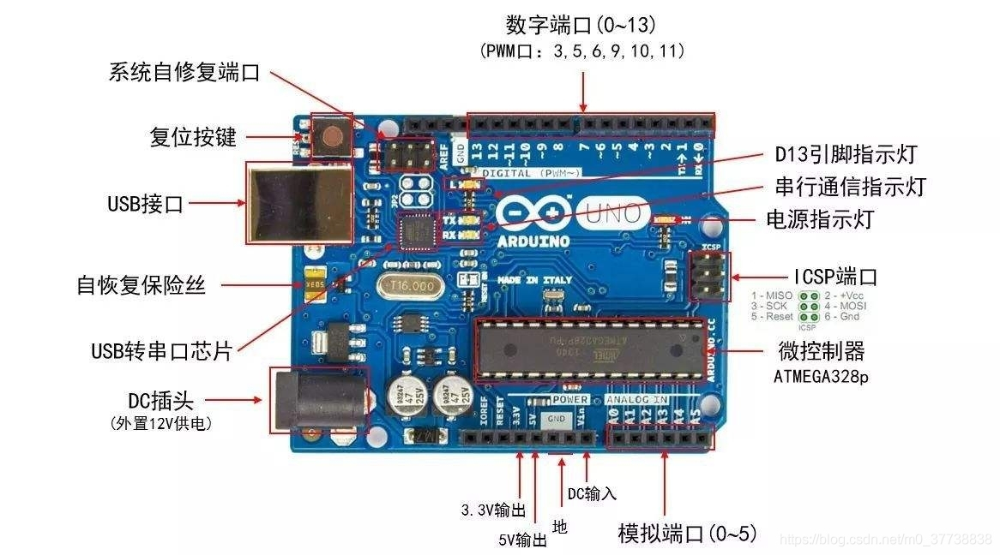

"Uno" means "one" in Italian. Arduino UNO is the first development board in the Arduino series, and Arduino IDE 1.0 is the first official version of the Arduino IDE. Arduino UNO hardware and Arduino IDE software establish a set of Arduino development standards, upon which subsequent Arduino boards and derivative products are built."


### Breadboard

Breadboard is an important tool used in laboratories for circuit prototyping. Mastering the use of breadboard is one of the key foundations to improve experimental efficiency and reduce the chances of experimental failures. 

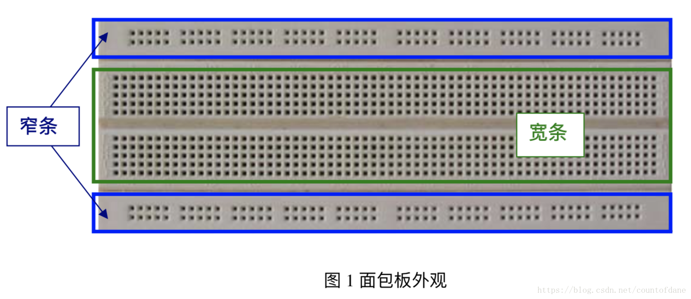

The common minimum unit breadboard consists of three parts: top, middle, and bottom. The top and bottom parts are usually narrow strips consisting of one or two rows of sockets, while the middle part consists of a wide strip with a central isolation groove and five rows of sockets on the top and bottom.

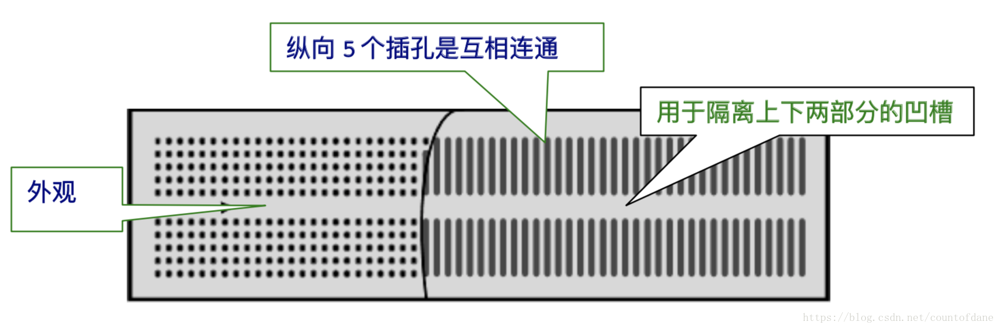

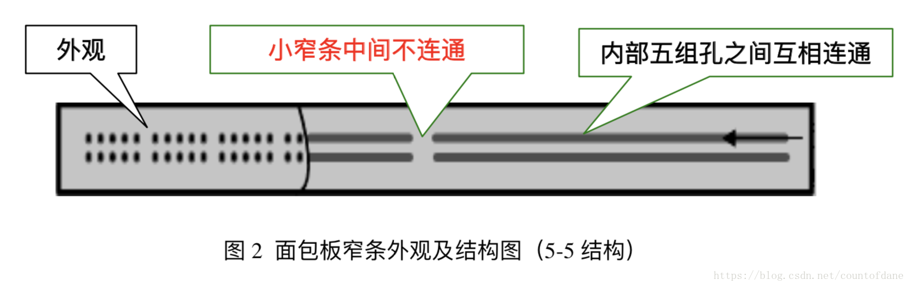

### DuPont wire

A DuPont wire is a commonly used cable for connecting electronic components. It is typically made up of an insulated copper wire with a plastic housing. They have a male connector on one end and a female connector on the other end, allowing for easy insertion into pins on a breadboard or other electronic components. DuPont wires are commonly used to connect signals and power lines between Arduino development boards, sensors, modules, and other electronic components.

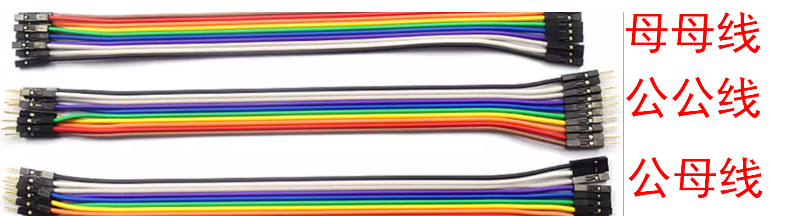

### Resistor

In the Arduino platform, a resistor component is an electronic component that is used to limit the flow of electric current in a circuit. It is typically made of a cylindrical body with two leads or terminals. The resistance value of a resistor is measured in ohms (Ω) and determines the amount of current that can pass through it. Resistor components are commonly used in Arduino projects to control the voltage levels, limit current flow, and adjust signal levels. They are essential for tasks such as voltage dividers, current limiting, and pull-up or pull-down resistors.

#### Color ring resistor

Color ring resistor is the most commonly used electronic component in electronic circuits. It is a regular resistor with colored bands painted on it to indicate its resistance value. This ensures that the resistance value can be easily read regardless of the direction in which the resistor is installed. The basic units for color ring resistors are ohms (Ω), kilohms (KΩ), and megohms (MΩ). 1 megohm (MΩ) = 1000 kilohms (KΩ) = 1,000,000 ohms (Ω).

Use the color ring resistance identification chart for identification.

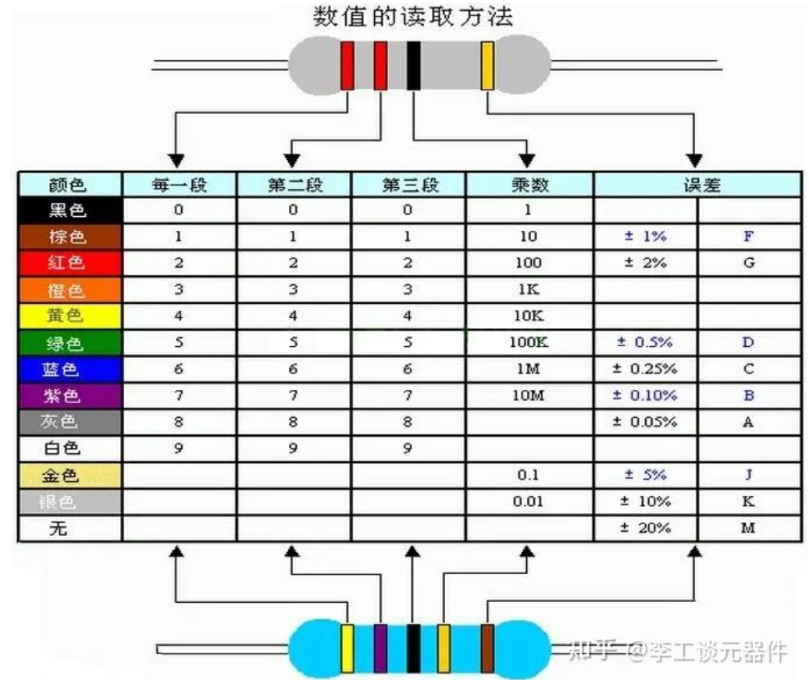

#### chip resistor

A chip resistor is a type of resistor made from thin film or foil, and is commonly used for precision resistors and voltage regulators in electronic circuits. They are compact in size, and offer high precision and stability, making them widely used in various electronic devices and circuits. Chip resistors can be manufactured using different materials and processes to meet various circuit requirements.

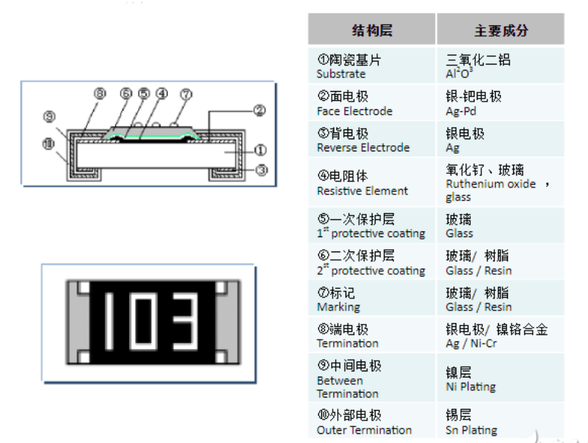


### LED

LED stands for Light Emitting Diode. It is a semiconductor device that emits light when an electric current passes through it. LEDs are commonly used in electronic devices, lighting fixtures, and displays. They are small, energy-efficient, and available in various colors. LEDs have become popular due to their long lifespan, low power consumption, and durability. They are widely used in Arduino projects for indicators, status lights, and visual feedback.

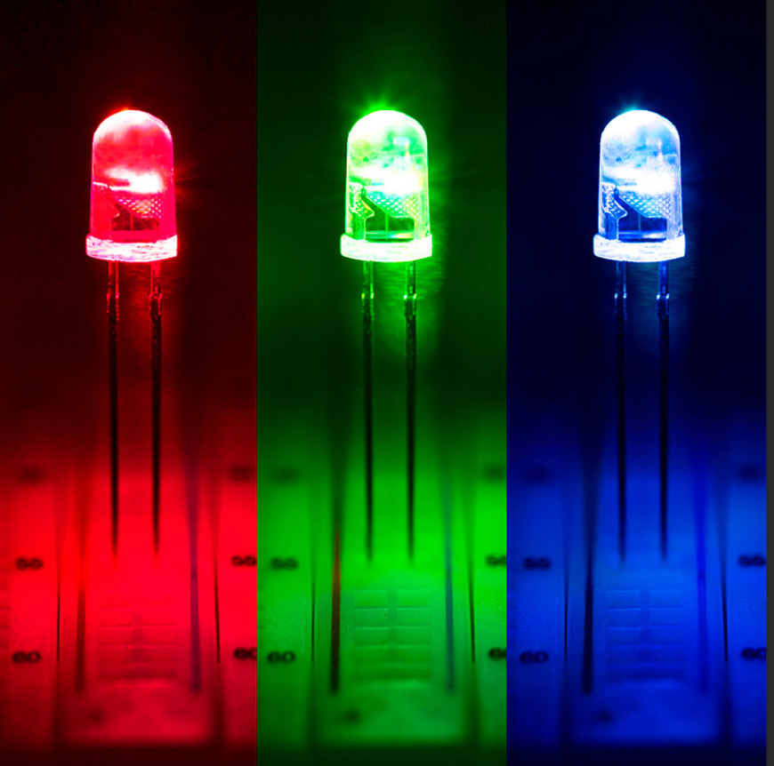

## Arduino IDE

Reference：[Arduino IDE使用教程](https://blog.csdn.net/as480133937/article/details/105331315)

### What is Arduino IDE？
IDE (Integrated Development Environment) is equivalent to a combination of editor, compiler, linker, and other tools. Arduino IDE is a programming software specifically designed for Arduino, provided by the Arduino team. With Arduino IDE, we can upload programs from code to the Arduino board.

### Download IDE

Download the latest version of Arduino IDE: [Arduino IDE](https://www.arduino.cc/en/software)

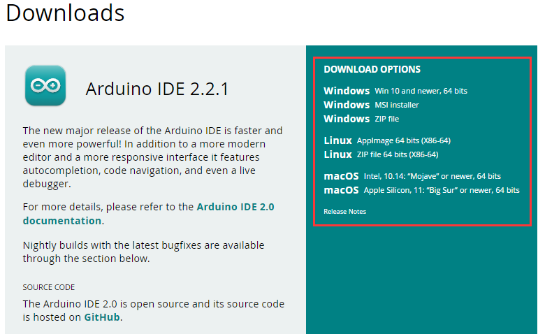

### IDE Interface

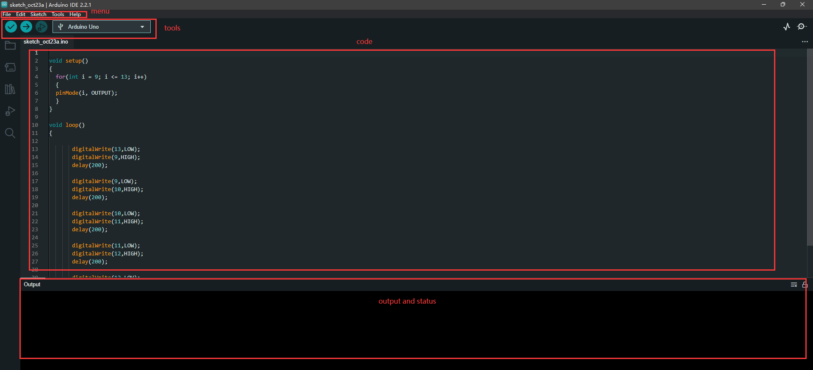

The interface is roughly divided into four parts:

* Menu bar: It includes file menu, edit menu, program menu, tools menu, and help menu.
  
* Toolbar: It includes compile, upload, new sketch, open sketch, save sketch, and serial monitor.
  
* Editor area: This is where you write your program code
  
* tatus area: It displays information about program compilation, upload, and any error messages if the program encounters errors.

### Configure IDE

Reference：[Arduino IDE使用教程](https://blog.csdn.net/as480133937/article/details/105331315)

1. Connect your hardware device (e.g., Arduino board) to your computer using a USB cable.
   
2. Open the Arduino IDE on your computer.

3. Go to the "Tools" menu in the Arduino IDE.

4. Select the appropriate board from the "Board" submenu. Choose the specific model of your hardware device (e.g., Arduino Uno, Arduino Mega).

5. Select the correct port from the "Port" submenu. This is the port to which your hardware device is connected.

6. If necessary, configure other settings such as programmer, processor, or other board-specific options.

7. Once you have selected the appropriate board and port, you are ready to upload your code to the hardware device.

## Code basics
Arduino programs are written in C/C++. Although C++ is compatible with C, they are two different languages. C is a procedural programming language, while C++ is an object-oriented programming language. The early Arduino core library was written in C, but later introduced object-oriented concepts. The latest Arduino core library is a mixture of C and C++.

When we talk about the Arduino language, we are referring to the collection of various application programming interfaces (APIs) provided by the Arduino core library. These APIs are a second-level encapsulation of lower-level microcontroller support libraries. For example, the Arduino core library for AVR microcontrollers is a second-level encapsulation of AVR-Libc (a GCC-based AVR support library).

### Basics of C Language

Reference：[Arduino语言教程](https://blog.csdn.net/as480133937/article/details/105322822)


### Structure of Arduino Language

**The Arduino software structure consists of two main functions**

```c

void setup() 
{ 
  //Initialization operation
}

void loop() 
{
  //Continuous looping function
}

```


* setup() function: It initializes variables, pin modes, and calls library functions.

* loop() function: It continuously loops and executes the program inside the loop function.

### Arduino I/O Functions 

Digital I/O functions define the input/output mode of digital I/O pins, allowing you to set a pin as either an input or an output interface.

The pinMode() function is used to configure a specific pin as either an input or an output. You can use the INPUT_PULLUP mode to enable the internal pull-up resistor. Additionally, the INPUT mode explicitly disables the internal pull-up.

```c

　pinMode(pin1，INPUT)

  pinMode(pin2，OUTPUT)

  ...

  // pin - The number of the pin you want to set the mode for, ranging from 0 to 13
  // mode - INPUT (input mode), OUTPUT (output mode)

```
The digitalWrite() function is used to define the output level of a digital I/O pin, setting it to either HIGH or LOW, which corresponds to high or low voltage levels, respectively. However, before using digitalWrite, the pin must be explicitly declared as an input or output mode using pinMode. For example, defining HIGH can be used to drive an LED.

```c
digitalWrite(pin,value);  //Defines the level of the pin

```

## Compile and upload the code

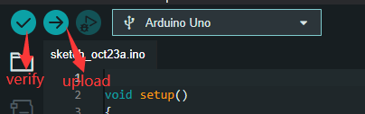


To compile and upload code in the Arduino IDE, follow these steps:

1. Click on the "Verify" button (checkmark icon) or go to "Sketch" > "Verify/Compile" to compile the code. This step checks for any syntax errors in the code.

2. Once the code is successfully compiled, click on the "Upload" button (right arrow icon) or go to "Sketch" > "Upload" to upload the code to the Arduino board.

3. The IDE will compile the code again and then upload it to the connected Arduino board.

4. Wait for the upload process to complete. You can monitor the progress in the status area at the bottom of the IDE.

5. Once the upload is finished, the code will start running on the Arduino board.


# Display Screen

## LCD 1602 Screen

LCD1602 is a type of liquid crystal display module that consists of 16 columns and 2 rows. It is commonly used in various electronic devices for displaying alphanumeric characters and symbols. The module utilizes a backlight to enhance visibility in low light conditions.


LCD1602 is compatible with microcontrollers and can be easily connected to them using a 16-pin interface. It has a built-in controller chip that simplifies the programming process. The module supports both 4-bit and 8-bit data transmission modes, providing flexibility in data transfer.


The LCD1602 module offers a wide viewing angle and high contrast ratio, ensuring clear and sharp display of information. It is capable of displaying a range of characters, including letters, numbers, and special symbols. Additionally, it supports cursor positioning and scrolling, allowing for dynamic content presentation.


With its compact size and easy integration, LCD1602 is widely used in various applications such as digital clocks, temperature displays, and menu interfaces. Its simplicity and versatility make it a popular choice for electronic projects and prototypes.

## LCD 1602 Pin Signal Description

| 引脚号 | 引脚名 | 电平 | 输入/输出 | 作用                  |
| ------ | ------ | ---- | --------- | --------------------- |
| 1      | Vss    |      |           | 电源地                |
| 2      | Vcc    |      |           | 电源（+5V）           |
| 3      | Vee    |      |           | 对比调整电压          |
| 4      | RS     | 0/1  | 输入      | 0=输入指令；1=输出数据 |
| 5      | R/W    | 0/1  | 输入      | 0=向LCD写入指令或数据； 1=从LCD读取信息 |
| 6      | E      | 1，1->0 | 输入   | 使能信号，1时读取信息，1->0（下降沿）执行指令 |
| 7      | DB0    | 0/1  | 输入/输出 | 数据总线line0（最低位） |
| 8      | DB1    | 0/1  | 输入/输出 | 数据总线line1          |
| 9      | DB2    | 0/1  | 输入/输出 | 数据总线line2          |
| 10     | DB3    | 0/1  | 输入/输出 | 数据总线line3          |
| 11     | DB4    | 0/1  | 输入/输出 | 数据总线line4          |
| 12     | DB5    | 0/1  | 输入/输出 | 数据总线line5          |
| 13     | DB6    | 0/1  | 输入/输出 | 数据总线line6          |
| 14     | DB7    | 0/1  | 输入/输出 | 数据总线line7          |
| 15     | A      | +Vcc |           | LCD背光灯源正极        |
| 16     | K      | 接地 |           | LCD背光灯源负极        |


## Achievement display


## Circuit connection

This project uses a 220 ohm resistor.


## Code display

```c
#include <LiquidCrystal.h>

LiquidCrystal lcd(12,11,,5,4,3,2);

void setup() {
  // put your setup code here, to run once:
lcd.begin(16,2);
lcd.print("hello,world!")

}

void loop() {
  // put your main code here, to run repeatedly:
lcd.setCursor(0,1);
lcd.print(millis()/1000);
}
```

## Nixie tube

## Achievement display

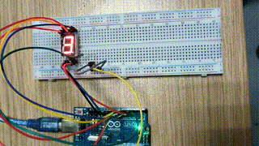


## Circuit connection

This project uses a 220 ohm resistor.


## Code display

```c
int pin_a = 7;
int pin_b = 6;
int pin_c = 5;
int pin_d = 10;
int pin_e = 11;
int pin_f = 8;
int pin_g = 9;
int pin_p = 4;


int numTable[10][8] = {

//a  b  c  d  e  f  g  dp
{1, 1, 1, 1, 1, 1, 0, 0},     //0
{0, 1, 1, 0, 0, 0, 0, 0},     //1
{1, 1, 0, 1, 1, 0, 1, 0},     //2
{1, 1, 1, 1, 0, 0, 1, 0},     //3
{0, 1, 1, 0, 0, 1, 1, 0},     //4
{1, 0, 1, 1, 0, 1, 1, 0},     //5
{1, 0, 1, 1, 1, 1, 1, 0},     //6
{1, 1, 1, 0, 0, 0, 0, 0},     //7
{1, 1, 1, 1, 1, 1, 1, 0},     //8
{1, 1, 1, 1, 0, 1, 1, 0},     //9
};


void setup()
{
for (int i = 4; i <= 11; i++)
{
pinMode(i, OUTPUT); 
}
}

void loop()
{
for (int i = 0; i < 10; i++)
{
digitalWrite(pin_a, numTable[i][0]); 
digitalWrite(pin_b, numTable[i][1]); 
digitalWrite(pin_c, numTable[i][2]); 
digitalWrite(pin_d, numTable[i][3]); 
digitalWrite(pin_e, numTable[i][4]); 
digitalWrite(pin_f, numTable[i][5]); 
digitalWrite(pin_g, numTable[i][6]); 
digitalWrite(pin_p, numTable[i][7]); 
delay(200);
}

}
```

# Servo Motor
Arduino servo motor is a type of motor commonly used in Arduino projects for precise control of angular position. It is designed to rotate between specific angles, making it ideal for applications that require controlled movement, such as robotics, automation, and remote-controlled devices.

The servo motor consists of a small DC motor, a gear mechanism, and a control circuit. It is controlled by sending PWM (Pulse Width Modulation) signals from the Arduino board. The PWM signals determine the position of the servo motor's shaft, allowing it to rotate to a specific angle within its range of motion.

## Achievement display


## Circuit connection

This project uses a 220 ohm resistor.


## Code display
```c
#include <Servo.h>
Servo myservo;
void setup(){
  myservo.attach(9);
}
void loop(){
  myservo.write(90);
  delay(1500);
  myservo.write(180);
  delay(1500);
}
```