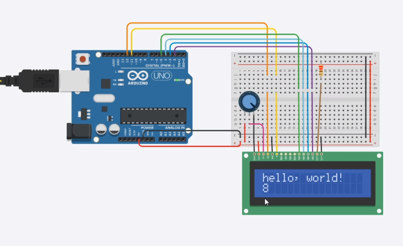

# LCD 1602 Screen

LCD1602 is a type of liquid crystal display module that consists of 16 columns and 2 rows. It is commonly used in various electronic devices for displaying alphanumeric characters and symbols. The module utilizes a backlight to enhance visibility in low light conditions.


LCD1602 is compatible with microcontrollers and can be easily connected to them using a 16-pin interface. It has a built-in controller chip that simplifies the programming process. The module supports both 4-bit and 8-bit data transmission modes, providing flexibility in data transfer.


The LCD1602 module offers a wide viewing angle and high contrast ratio, ensuring clear and sharp display of information. It is capable of displaying a range of characters, including letters, numbers, and special symbols. Additionally, it supports cursor positioning and scrolling, allowing for dynamic content presentation.


With its compact size and easy integration, LCD1602 is widely used in various applications such as digital clocks, temperature displays, and menu interfaces. Its simplicity and versatility make it a popular choice for electronic projects and prototypes.

## LCD 1602 Pin Signal Description

| 引脚号 | 引脚名 | 电平 | 输入/输出 | 作用                  |
| ------ | ------ | ---- | --------- | --------------------- |
| 1      | Vss    |      |           | 电源地                |
| 2      | Vcc    |      |           | 电源（+5V）           |
| 3      | Vee    |      |           | 对比调整电压          |
| 4      | RS     | 0/1  | 输入      | 0=输入指令；1=输出数据 |
| 5      | R/W    | 0/1  | 输入      | 0=向LCD写入指令或数据； 1=从LCD读取信息 |
| 6      | E      | 1，1->0 | 输入   | 使能信号，1时读取信息，1->0（下降沿）执行指令 |
| 7      | DB0    | 0/1  | 输入/输出 | 数据总线line0（最低位） |
| 8      | DB1    | 0/1  | 输入/输出 | 数据总线line1          |
| 9      | DB2    | 0/1  | 输入/输出 | 数据总线line2          |
| 10     | DB3    | 0/1  | 输入/输出 | 数据总线line3          |
| 11     | DB4    | 0/1  | 输入/输出 | 数据总线line4          |
| 12     | DB5    | 0/1  | 输入/输出 | 数据总线line5          |
| 13     | DB6    | 0/1  | 输入/输出 | 数据总线line6          |
| 14     | DB7    | 0/1  | 输入/输出 | 数据总线line7          |
| 15     | A      | +Vcc |           | LCD背光灯源正极        |
| 16     | K      | 接地 |           | LCD背光灯源负极        |


## Achievement display


## Circuit connection

This project uses a 220 ohm resistor.




## Code display

```c
#include <LiquidCrystal.h>

LiquidCrystal lcd(12,11,,5,4,3,2);

void setup() {
  // put your setup code here, to run once:
lcd.begin(16,2);
lcd.print("hello,world!")

}

void loop() {
  // put your main code here, to run repeatedly:
lcd.setCursor(0,1);
lcd.print(millis()/1000);
}
```