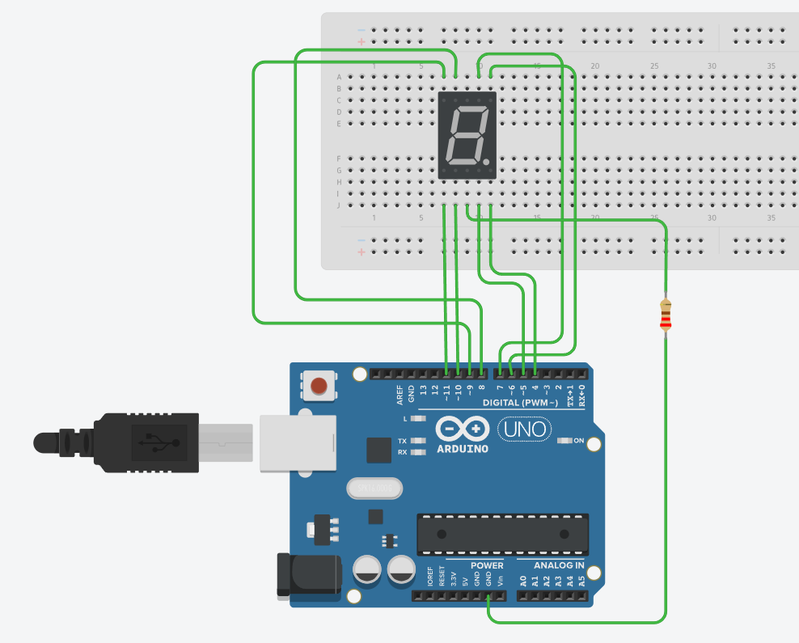

# Nixie tube

## Achievement display


## Circuit connection

This project uses a 220 ohm resistor.



## Code display

```c
int pin_a = 7;
int pin_b = 6;
int pin_c = 5;
int pin_d = 10;
int pin_e = 11;
int pin_f = 8;
int pin_g = 9;
int pin_p = 4;


int numTable[10][8] = {

//a  b  c  d  e  f  g  dp
{1, 1, 1, 1, 1, 1, 0, 0},     //0
{0, 1, 1, 0, 0, 0, 0, 0},     //1
{1, 1, 0, 1, 1, 0, 1, 0},     //2
{1, 1, 1, 1, 0, 0, 1, 0},     //3
{0, 1, 1, 0, 0, 1, 1, 0},     //4
{1, 0, 1, 1, 0, 1, 1, 0},     //5
{1, 0, 1, 1, 1, 1, 1, 0},     //6
{1, 1, 1, 0, 0, 0, 0, 0},     //7
{1, 1, 1, 1, 1, 1, 1, 0},     //8
{1, 1, 1, 1, 0, 1, 1, 0},     //9
};


void setup()
{
for (int i = 4; i <= 11; i++)
{
pinMode(i, OUTPUT); 
}
}

void loop()
{
for (int i = 0; i < 10; i++)
{
digitalWrite(pin_a, numTable[i][0]); 
digitalWrite(pin_b, numTable[i][1]); 
digitalWrite(pin_c, numTable[i][2]); 
digitalWrite(pin_d, numTable[i][3]); 
digitalWrite(pin_e, numTable[i][4]); 
digitalWrite(pin_f, numTable[i][5]); 
digitalWrite(pin_g, numTable[i][6]); 
digitalWrite(pin_p, numTable[i][7]); 
delay(200);
}

}
```