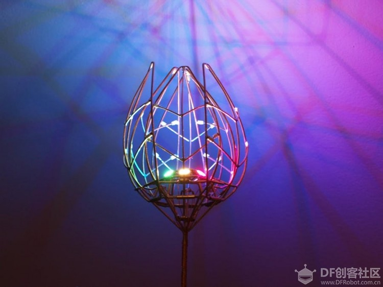

# Introduction to Open Source Projects

## Tulips in bloom forever
[Tulips](https://mc.dfrobot.com.cn/thread-275324-1-1.html)
Mechanical tulip sculptures, which bloom with just a light touch, can emit colorful light

### Highlights of the Project
* Unique interaction methods
* Elegant appearance
* Market potential for mass production