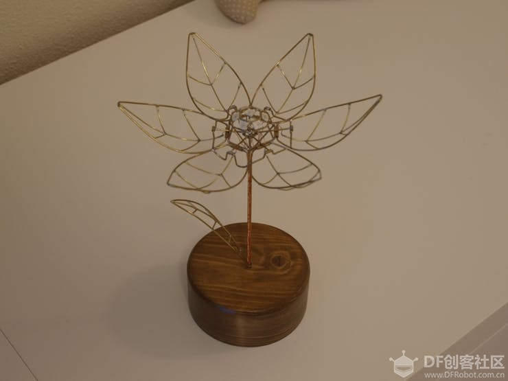

# Introduction to Open Source Projects

## Tulips in bloom forever
[Tulips](https://mc.dfrobot.com.cn/thread-275324-1-1.html)
Mechanical tulip sculptures, which bloom with just a light touch, can emit colorful light

### Highlights of the Project

* Unique interaction methods
* Elegant appearance
* Market potential for mass production

### Working Principle

* The tulip consists of 6 petals, each with 5 SMD white LEDs.
* Each petal is connected to an Arduino output pin.
The stamen hides 7 RGB LEDs.
* The entire flower is negatively charged, while the veins in the petals are positively charged from an electrical perspective.
* The petals open up by a push rod that extends along the stem towards the base.
* The movement of the push rod is controlled by a small servo motor.
* The small leaf on the side of the push rod is connected to a TTP223 touch sensor inside the base, creating a capacitive touchpad.
* The wooden base contains the servo, touch IC, and Arduino Nano.

### Interaction Method

* The mechanical tulip requires an interactive element to make it bloom, and the chosen element is the TTP223 touch sensor.
* To incorporate the touch sensor, a small leaf is added to the side of the stem, serving as a capacitive touchpad.
* When the touchpad is touched, it triggers the TTP223 sensor, instructing the Arduino to open the flower.
* LED lights are omitted using the same technique as the petals, creating a seamless appearance.
A template is created to assist in the construction process.
* To secure the leaf, a small hole is drilled on the base next to the stem hole.
* Alternatively, a regular button can be added to the base as an alternative to the touch sensor for triggering the flower's opening mechanism.