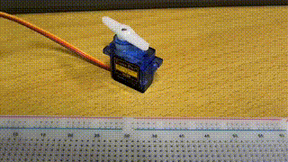
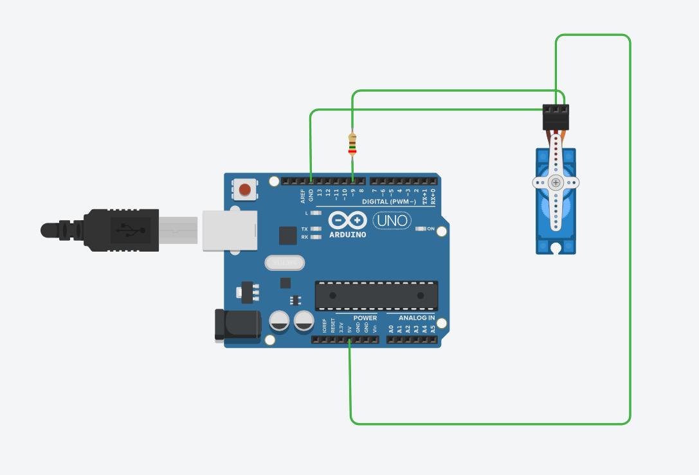

# Servo Motor
Arduino servo motor is a type of motor commonly used in Arduino projects for precise control of angular position. It is designed to rotate between specific angles, making it ideal for applications that require controlled movement, such as robotics, automation, and remote-controlled devices.

The servo motor consists of a small DC motor, a gear mechanism, and a control circuit. It is controlled by sending PWM (Pulse Width Modulation) signals from the Arduino board. The PWM signals determine the position of the servo motor's shaft, allowing it to rotate to a specific angle within its range of motion.

## Achievement display



## Circuit connection

This project uses a 220 ohm resistor.



## Code display
```c
#include <Servo.h>
Servo myservo;
void setup(){
  myservo.attach(9);
}
void loop(){
  myservo.write(90);
  delay(1500);
  myservo.write(180);
  delay(1500);
}
```
